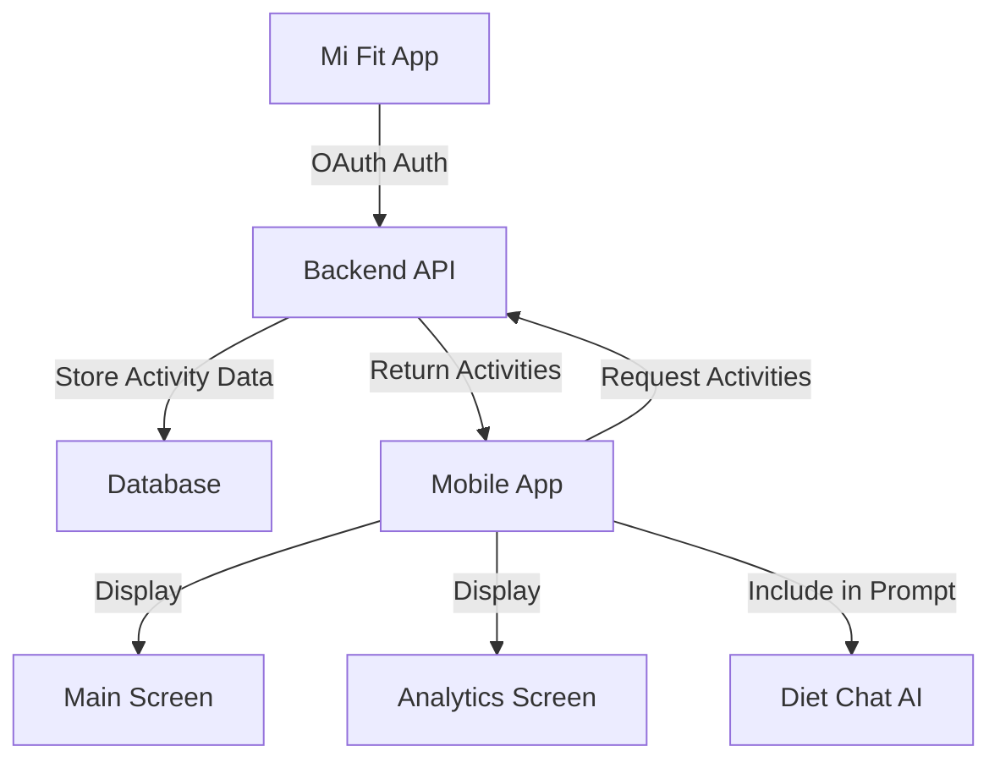

# План интеграции Mi Fit для отслеживания активностей

## Цель

Интегрировать приложение с Mi Fit (Xiaomi) для автоматического отслеживания физических активностей пользователя и отображения данных на главном экране и в аналитике.

## Архитектура



## Компоненты реализации

### 1. Backend API (документация в API_CONTRACT.md)

#### 1.1. OAuth авторизация Mi Fit

- **Endpoint:** `POST /my-food/fitness/mi-fit/authorize`
- **Описание:** Инициирует OAuth flow с Mi Fit, сохраняет access token и refresh token
- **Request:** `{ authorizationCode: string, redirectUri: string }`
- **Response:** `{ connected: boolean, expiresAt: string }`

#### 1.2. Получение данных о активностях за день

- **Endpoint:** `GET /my-food/fitness/activities?date=YYYY-MM-DD`
- **Описание:** Возвращает данные о всех активностях за указанный день
- **Response:**
```json
{
  "date": "2025-01-15",
  "totalSteps": 12500,
  "totalCaloriesBurned": 450,
  "activities": [
    {
      "id": 1,
      "type": "RUNNING",
      "duration": 15,
      "caloriesBurned": 180,
      "distance": 2.5,
      "startTime": "2025-01-15T07:30:00",
      "endTime": "2025-01-15T07:45:00",
      "metadata": {}
    },
    {
      "id": 2,
      "type": "TREADMILL",
      "duration": 30,
      "caloriesBurned": 270,
      "distance": 4.0,
      "startTime": "2025-01-15T18:00:00",
      "endTime": "2025-01-15T18:30:00",
      "metadata": {}
    }
  ]
}
```


#### 1.3. Синхронизация данных с Mi Fit

- **Endpoint:** `POST /my-food/fitness/mi-fit/sync`
- **Описание:** Принудительная синхронизация данных с Mi Fit API
- **Response:** `{ synced: boolean, activitiesCount: number, dateRange: { from: string, to: string } }`

#### 1.4. Отключение интеграции

- **Endpoint:** `DELETE /my-food/fitness/mi-fit/disconnect`
- **Описание:** Отключает интеграцию с Mi Fit, удаляет токены
- **Response:** `204 No Content`

#### 1.5. Статус интеграции

- **Endpoint:** `GET /my-food/fitness/mi-fit/status`
- **Описание:** Проверяет статус подключения к Mi Fit
- **Response:** `{ connected: boolean, lastSyncAt: string | null, expiresAt: string | null }`

#### 1.6. Статистика активностей за период

- **Endpoint:** `GET /my-food/fitness/statistics?startDate=YYYY-MM-DD&endDate=YYYY-MM-DD`
- **Описание:** Агрегированная статистика за период
- **Response:**
```json
{
  "startDate": "2025-01-01",
  "endDate": "2025-01-15",
  "totalSteps": 185000,
  "totalCaloriesBurned": 6750,
  "averageDailySteps": 12333,
  "averageDailyCalories": 450,
  "activitiesByType": {
    "RUNNING": { "count": 12, "totalDuration": 180, "totalCalories": 2160 },
    "TREADMILL": { "count": 8, "totalDuration": 240, "totalCalories": 2160 }
  }
}
```


### 2. Frontend Implementation

#### 2.1. Types (`src/types/api.types.ts`)

Добавить типы:

- `ActivityType`: `'RUNNING' | 'TREADMILL' | 'WALKING' | 'CYCLING' | 'SWIMMING' | 'OTHER'`
- `Activity`: интерфейс для одной активности
- `DailyActivitiesResponse`: ответ с активностями за день
- `FitnessStatisticsResponse`: статистика за период
- `MiFitStatusResponse`: статус интеграции

#### 2.2. API Service (`src/api/services/fitness.service.ts`)

Создать новый сервис с методами:

- `authorizeMiFit(authorizationCode: string, redirectUri: string)`
- `getDailyActivities(date: string)`
- `syncMiFit()`
- `disconnectMiFit()`
- `getMiFitStatus()`
- `getFitnessStatistics(startDate: string, endDate: string)`

#### 2.3. Store (`src/stores/FitnessStore.ts`)

Создать новый MobX store:

- `activities: Map<string, DailyActivitiesResponse>` - кэш по датам
- `statistics: FitnessStatisticsResponse | null`
- `miFitStatus: MiFitStatusResponse | null`
- `loading: boolean`
- `error: string | null`
- Методы:
  - `loadDailyActivities(date: string)`
  - `syncMiFit()`
  - `disconnectMiFit()`
  - `loadMiFitStatus()`
  - `loadStatistics(startDate: string, endDate: string)`
  - `reset()`

#### 2.4. RootStore Integration (`src/stores/RootStore.ts`)

- Добавить `fitnessStore: FitnessStore` в RootStore
- Добавить в `reset()` метод

#### 2.5. API Routes (`src/api/apiRoutes.ts`)

Добавить секцию:

```typescript
Fitness: {
  Activities: '/fitness/activities',
  Statistics: '/fitness/statistics',
  MiFit: {
    Authorize: '/fitness/mi-fit/authorize',
    Sync: '/fitness/mi-fit/sync',
    Disconnect: '/fitness/mi-fit/disconnect',
    Status: '/fitness/mi-fit/status',
  },
}
```

### 3. UI Components

#### 3.1. Main Screen Integration (`src/screens/main/MainScreen.tsx`)

- Загружать данные о активностях при загрузке данных за день
- Передавать данные в `DailySummary` компонент

#### 3.2. DailySummary Enhancement (`src/components/main/DailySummary.tsx`)

Добавить секцию с активностями:

- Общее количество шагов
- Сожженные калории
- Краткий список активностей (если есть)
- Кнопка для подключения Mi Fit (если не подключено)

#### 3.3. Activity Card Component (`src/components/main/ActivityCard.tsx`)

Новый компонент для отображения активностей:

- Список активностей за день
- Тип активности с иконкой
- Длительность и сожженные калории
- Время начала/окончания

#### 3.4. Mi Fit Connection Screen (`src/screens/main/MiFitConnectionScreen.tsx`)

Новый экран для подключения Mi Fit:

- Инструкции по подключению
- Кнопка "Подключить Mi Fit"
- OAuth flow обработка
- Статус подключения

#### 3.5. Analytics Integration (`src/screens/main/AnalyticsScreen.tsx`)

Добавить новую вкладку или секцию "Активности":

- График шагов за период
- График сожженных калорий
- Распределение по типам активностей
- Статистика по дням

#### 3.6. Fitness Statistics Component (`src/components/analytics/FitnessStatistics.tsx`)

Новый компонент для аналитики:

- График шагов (LineChart)
- График калорий (LineChart)
- Распределение по типам активностей (PieChart)
- Средние значения за период

### 4. Prompt Integration

#### 4.1. Prompt Builder Update (`src/utils/promptBuilders.ts`)

Обновить `buildDailyAnalysisPrompt`:

- Добавить параметр `activities?: DailyActivitiesResponse`
- Включить информацию об активностях в промпт:
  - Общее количество шагов
  - Сожженные калории
  - Типы активностей и их длительность
- Учесть сожженные калории при анализе баланса калорий

#### 4.2. Main Screen Prompt (`src/screens/main/MainScreen.tsx`)

- Загружать данные о активностях перед созданием промпта
- Передавать в `buildDailyAnalysisPrompt`

#### 4.3. Diet Chat Context (`docs/API_CONTRACT.md`)

Обновить документацию Diet Chat:

- AI получает контекст активностей за последние 7 дней
- Учитывает сожженные калории при рекомендациях

### 5. Navigation

#### 5.1. Navigation Types (`src/types/navigation.types.ts`)

Добавить экран:

- `MiFitConnection: undefined` в `MainStackParamList`

#### 5.2. Navigation Setup (`src/navigation/MainNavigator.tsx`)

Добавить экран `MiFitConnectionScreen` в навигатор

### 6. Settings Integration

#### 6.1. Profile Settings (`src/screens/main/ProfileScreen.tsx` или аналогичный)

Добавить секцию "Интеграции":

- Статус подключения Mi Fit
- Кнопка подключения/отключения
- Последняя синхронизация

## Порядок реализации

1. **Backend API документация** - описать все эндпоинты в `docs/API_CONTRACT.md`
2. **Types & API Service** - создать типы и сервис для работы с API
3. **Store** - создать FitnessStore и интегрировать в RootStore
4. **Main Screen** - добавить загрузку и отображение активностей
5. **DailySummary** - обновить компонент для показа активностей
6. **Activity Card** - создать компонент для списка активностей
7. **Integrations Screen** - создать экран управления интеграциями с поддержкой Mi Fit и расширяемой структурой для будущих интеграций
8. **Analytics** - добавить аналитику активностей
9. **Prompt Integration** - обновить промпты для учета активностей
10. **Settings** - добавить настройки интеграции

## Дополнительные соображения

- **Автосинхронизация:** Backend должен периодически синхронизировать данные с Mi Fit API (например, раз в час)
- **Кэширование:** Данные о активностях кэшируются на клиенте по датам
- **Офлайн режим:** При отсутствии интернета показывать последние загруженные данные
- **Ошибки:** Обрабатывать случаи, когда Mi Fit API недоступен или токен истек
- **Приватность:** Пользователь должен иметь возможность отключить интеграцию в любой момент

## Файлы для создания/изменения

**Новые файлы:**

- `src/stores/FitnessStore.ts`
- `src/api/services/fitness.service.ts`
- `src/components/main/ActivityCard.tsx`
- `src/components/analytics/FitnessStatistics.tsx`
- `src/screens/main/IntegrationsScreen.tsx`
- `src/components/integrations/IntegrationCard.tsx` - переиспользуемый компонент для карточки интеграции

**Изменяемые файлы:**

- `src/types/api.types.ts` - добавить типы активностей
- `src/api/apiRoutes.ts` - добавить routes для fitness
- `src/stores/RootStore.ts` - добавить fitnessStore
- `src/components/main/DailySummary.tsx` - добавить секцию активностей
- `src/screens/main/MainScreen.tsx` - загрузка и передача данных
- `src/screens/main/AnalyticsScreen.tsx` - добавить аналитику
- `src/utils/promptBuilders.ts` - обновить промпт
- `src/types/navigation.types.ts` - добавить экран
- `src/navigation/MainNavigator.tsx` - добавить маршрут
- `docs/API_CONTRACT.md` - описать API эндпоинты